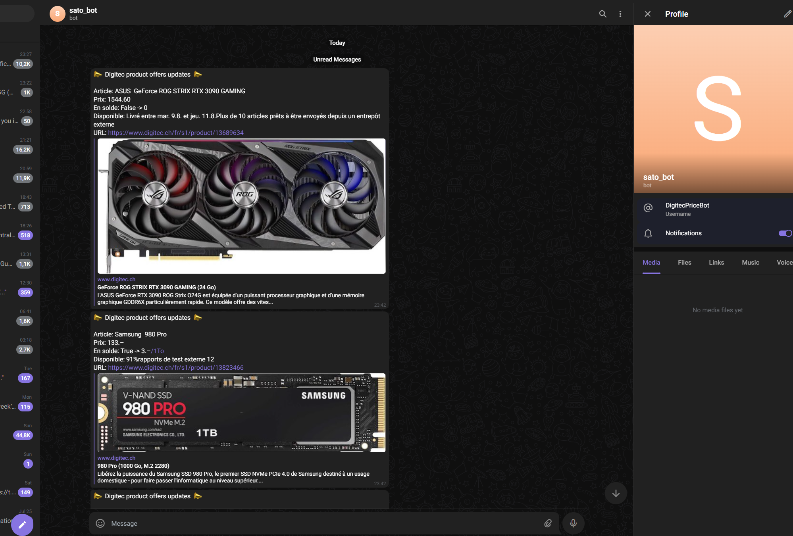

<p align="center">
  <a href="https://github.com/Iyotee/DigitecPriceNAvailabilityBot">
    
  </a>

  <h3 align="center">DigitecPriceBot2Telegram</h3>

  <p align="center">
    A simple python script to crawl the Switzerland companies both Digitec and Galaxus AG websites products list
    <br/>
    <br/>
    <a href="https://github.com/Iyotee/DigitecPriceNAvailabilityBot"><strong>Explore the docs »</strong></a>
    <br/>
    <br/>
    <a href="https://github.com/Iyotee/DigitecPriceNAvailabilityBot">View Demo</a>
    .
    <a href="https://github.com/Iyotee/DigitecPriceNAvailabilityBot/issues">Report Bug</a>
    .
    <a href="https://github.com/Iyotee/DigitecPriceNAvailabilityBot/issues">Request Feature</a>
  </p>
</p>

   


## Table Of Contents

* [About the Project](#about-the-project)
* [Built With](#built-with)
* [Getting Started](#getting-started)
  * [Prerequisites](#prerequisites)
  * [Installation](#installation)
* [Usage](#usage)
* [Roadmap](#roadmap)
* [Contributing](#contributing)
* [License](#license)
* [Authors](#authors)


## About The Project


A simple python script to crawl the Switzerland companies both websites Digitec and Galaxus AG products list



Here's why:

* Because both companies are great
* Because i need low prices everytime
* Because i love 'em


## Built With

Python
BeautifulSoup4

Coffee and Love

## Getting Started

Clone this repo

### Prerequisites

You should already or have to create a bot on telegram, thus returns you a token. Then you can ask the Telegram UserID bot to give you your User ID.

* pip

```sh
sudo apt-get install python3-pip -y
```

### Installation

1. Get a free API Key from Telegram @BotFather

2. Clone the repo

```sh
git clone https://github.com/iyotee/DigitecPriceNAvailabilityBot.git
```

3. Install pip packages

```sh
python3 pip install python-telegram-bot -y
```

```sh
python3 pip install requests -y
```

```sh
python3 pip install bs4 -y
```

4. Enter your API in `main.py`


## Usage

you can create a cron task every hour ( 0 * * * * ) 

```sh
crontab -e
```
edit the end of the files by appending :
```sh
0 * * * * python3 DigitecPriceNAvailabilityBot/main.py
```

Save and exit with ctrl+x and that's it ! Your bot is now running and sending your message on your Telegram user every hour ! 🎊


## Roadmap

See the [open issues](https://github.com/Iyotee/DigitecPriceNAvailabilityBot/issues) for a list of proposed features (and known issues).

## Contributing

Contributions are what make the open source community such an amazing place to be learn, inspire, and create. Any contributions you make are **greatly appreciated**.
* If you have suggestions for adding or removing projects, feel free to [open an issue](https://github.com/Iyotee/DigitecPriceNAvailabilityBot/issues/new) to discuss it, or directly create a pull request after you edit the *README.md* file with necessary changes.
* Please make sure you check your spelling and grammar.
* Create individual PR for each suggestion.
* Please also read through the [Code Of Conduct](https://github.com/Iyotee/DigitecPriceNAvailabilityBot/blob/main/CODE_OF_CONDUCT.md) before posting your first idea as well.

### Creating A Pull Request

1. Fork the Project
2. Create your Feature Branch (`git checkout -b feature/AmazingFeature`)
3. Commit your Changes (`git commit -m 'Add some AmazingFeature'`)
4. Push to the Branch (`git push origin feature/AmazingFeature`)
5. Open a Pull Request

## License

Distributed under the MIT License. See [LICENSE](https://github.com/Iyotee/DigitecPriceNAvailabilityBot/blob/main/LICENSE.md) for more information.

## Authors

* **Jérémy Noverraz** - *Comp Sci enthousiast* - [Iyotee](https://github.com/iyotee/) - *Made with a lot of coffee*
